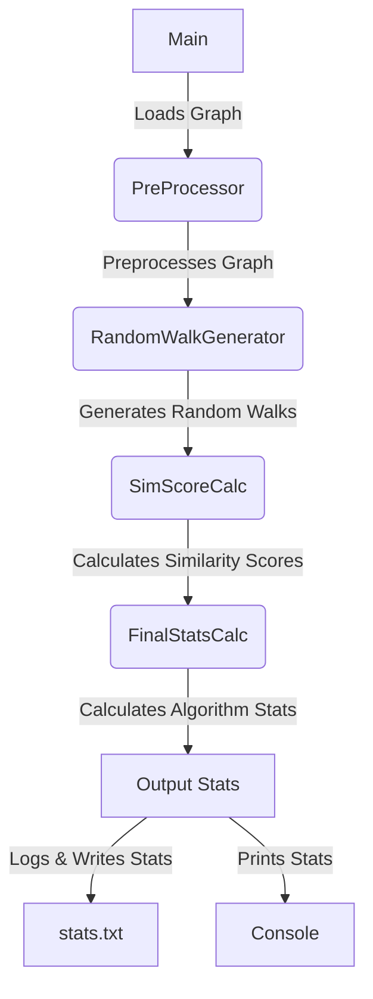

# MITM-Simulation-Using-Spark
- NetID: kjhave3@uic.edu
- Name: Kirtan Jhaveri
- youtube video:  
  https://www.youtube.com/watch?v=SuSEvcrSB4k

## Table of Contents

- [Overview](#overview)
- [Features](#features)
- [Usage](#usage)
- [Input](#input)
- [Output](#output)
- [Implementation Details](#implementation-details)
- [Dependencies](#dependencies)

## Overview:
The aim of this Project is to simulate an insider man-in-the-middle attack.  
**What is an insider attack?**  
It is when a member of the organization performs an attack on the resources or nodes from inside the organization since the attacker has knowledge of valuable data inside the organization.

## How the Attack Works :

### 1. Graph Setup

- **Original Graph:** Represents the actual network of the organization.
- **Perturbed Graph:** Represents a fabricated network layered on top of the original graph, designed to mislead attackers.

### 2. Random Walks and Similarity Scoring

- We perform random walks on the perturbed graph to avoid detection. During each walk, we compute a similarity score between the current node and all other nodes in the original graph.
- If the similarity score crosses a predefined threshold and the corresponding node in the original graph contains valuable data, an attack is initiated on the corresponding node in the perturbed graph.

### 3. Attack Validation

- To validate the success of our attack, we refer to an input YAML file containing information about nodes that were added, modified, or removed to generate the perturbed graph.
- If the attacked node in the perturbed graph falls among the added or modified nodes specified in the YAML file, the attack fails. These nodes act as honeypots, trapping attackers and leading to their detection.
- In all other scenarios, where the similarity score threshold isn't surpassed or the node from the original graph lacks valuable data, no attack is executed on the corresponding node in the perturbed graph.  
  **(Note: This is my personal logic for validating success ,one could consider other categories of nodes for validation)**

## Features :

- **Parallel Processing**: Utilizes Spark to process and compare graphs.

- **Matching Statistics**:The program calculates various matching statistics using the Jaccard Index, a popular similarity measure used in graph analysis. The Jaccard Index measures the similarity between two sets by dividing the size of the intersection by the size of the union of the sets. In the context of graph analysis, it is commonly used to compute similarities between nodes and edges between two graphs. This approach offers a practical solution to the graph isomorphism problem, a fundamental challenge in graph theory.

  The Jaccard Index calculations provide a quantitative measure  
  `(range 0.0 - 1.0)` of the similarity between graph components, aiding in the decision to attack on the perturbed node.

  **Graph Isomorphism Problem:** The graph isomorphism problem involves determining whether two given graphs are structurally identical, i.e., if one graph can be obtained from the other by permuting its vertices. It's a complex problem in computer science and mathematics, with applications in various fields. While the complete graph isomorphism problem remains a challenging task, our program partially addresses it by leveraging the Jaccard Index to assess the similarity between nodes and edges in different graphs. Although it doesn't solve the problem entirely, it provides valuable insights into graph similarities, aiding in practical applications such as network analysis and security assessment.

- **Node Similarities**: The Jaccard Index is used to compute the similarity between nodes in the original and perturbed graphs. High Jaccard Index values indicate nodes that are similar between the graphs.

- **Modifications in Perturbed Graphs**: By comparing the Jaccard Index scores, the program detects modifications between nodes in the perturbed graphs and original ones which assists in making decisions to attack a node in the perturbed graph.

- **Metrics Calculation**: Computes Number of Successful attacks, Number of Failed attacks; min, max, mean, median no of nodes in a random walk.

## Usage

To use the program, follow these steps:

1. **Install Dependencies**: Ensure all necessary dependencies are installed (see [Dependencies](#dependencies)).
2. **Run the Program**: Execute the main program file with appropriate input parameters.
3. **Review Output**: Analyze the generated text file and examine the computed metrics Successful, Failed attacks to assess the algorithm's performance.

## Input

The program takes input in the form of large graphs and their perturbed counterparts for parallel distributed processing. Input data should be formatted according to the specified graph representation.  
Please provide the .ngs , the .ngs.perturbed, the .ngs.yaml files as input to the program in the following directory of the project:  
`inputGraphs/filename  
eg: inputGraphs/300_nodes.ngs `  
The Main invocation file is:  
`Main.scala`  
The code takes in 4 arguments in the run configuration(in intellij), below are the arguments set in my run config please change them according to path on your system **(Note: This Project uses the local filesystem NOT HDFS)**:

**Using intellij run config**:

`PATH_TO\inputGraphs\300_nodes.ngs.perturbed`  
`PATH_TO\inputGraphs\300_nodes.ngs`  
`PATH_TO\inputGraphs\300_nodes.ngs.yaml`
`PATH_TO\outputs\stats.txt`

**Using SBT**:

`SBT "run PATH_TO\inputGraphs\300_nodes.ngs.perturbed PATH_TO\inputGraphs\300_nodes.ngs PATH_TO\inputGraphs\300_nodes.ngs.yamlPATH_TO\inputGraphs\300_nodes.ngs.yaml"`

**Using Spark-Submit**:

`spark-submit --class Main --master local[4] --class Main --jars C:\Users\kirta\Desktop\CS441\MITM-Simulation-using-Spark\target\sca
la-2.13\mitm1.jar --driver-class-path C:\Users\kirta\Desktop\CS441\MITM-Simulation-using-Spark\target\scala-2.13\mitm1.jar C:\Users\kirta\Desktop\CS
441\MITM-Simulation-using-Spark\target\scala-2.13\mitm1.jar C:\Users\kirta\Desktop\CS441\MITM-Simulation-using-Spark\inputGraphs\300_nodes.ngs.pertu
rbed C:\Users\kirta\Desktop\CS441\MITM-Simulation-using-Spark\inputGraphs\300_nodes.ngs C:\Users\kirta\Desktop\CS441\MITM-Simulation-using-Spark\inputGraphs\300_nodes.ngs.yaml C:\Users\kirta\Desktop\CS441\MITM-Simulation-using-Spark\outputs\stats.txt`

## Output

The program produces the following outputs as logs on the console and writes to file stats.txt

## Implementation Details

The program is implemented using `Scala` and utilizes `Spark/GraphX` for parallel processing and graph analysis. Detailed implementation information can be found in the source code.

There are 4 files in the project:

`Main.Scala`:  It contains the main entry point for the Man-In-The-Middle Attack Simulation program. It imports necessary libraries and initializes Spark configuration and context. The program processes input graphs, generates random walks, and calculates Jaccard similarity indices to simulate insider attacks within an organization's network. It leverages the Jaccard Index to compare nodes between the original and perturbed graphs. The comparison results are logged and used to calculate algorithm statistics. The file demonstrates the core logic for the attack simulation, showcasing how the program evaluates potential attacks while considering the similarity between nodes in different graphs.

`PreProcessor.scala:`  contains methods for preprocessing input graphs before the Man-In-The-Middle Attack Simulation. It defines functions to parse node objects, process nodes and edges, and create RDDs for further analysis. The `parseNodeObject` function extracts node information from a string representation. The `preprocessGraph` function reads the perturbed graph's nodes and edges, processes them, and creates RDDs for nodes and edges. The processed data is used in the main simulation to simulate attacks and calculate similarity scores. The file showcases essential preprocessing steps required to prepare the input data for the attack simulation.

`RandomWalkGenrator.scala:`  It provides the implementation for generating random walks in a given graph using the specified rules. The `randomWalks` method takes a graph, a list of starting nodes, and the maximum number of steps as input and produces a list of random walks.

The algorithm performs random walks starting from each specified node in the graph. For each start node, it explores neighboring nodes randomly, avoiding nodes already visited and stopping either when the maximum number of steps is reached or when all reachable nodes have been visited. The resulting paths are collected and returned as a list of lists of vertex IDs.

`SimScoreCalc.scala`: It contains functions related to similarity score calculation, specifically focusing on Jaccard similarity. The `calculateJaccardIndex` method computes the Jaccard similarity index between two `NodeObject` instances. It compares multiple attributes of the nodes, each represented as a field (e.g., `field1`, `field2`, ..., `field9`). The Jaccard index is calculated for each attribute, and the average Jaccard index across all attributes is returned as the final similarity score.

`FinalStatsCalc.scala`: It contains functions to calculate and analyze algorithm statistics in the Man-In-The-Middle Attack Simulation. The `calculateAlgorithmStats` method processes comparison results, evaluates successful and failed attacks considering node modifications, and outputs the results to the console and a stats file.

`GraphAttrFormat.scala`:  defines the data structures used in the Man-In-The-Middle Attack Simulation. It includes two case classes:

1.  **`EdgeObject`**: Represents an edge in the graph with `sourceNodeId` and `destinationNodeId` attributes. This class encapsulates the information needed to define connections between nodes in the network.

2.  **`NodeObject`**: Represents a node in the graph with detailed attributes:

  -   `nodeId`: Unique identifier for the node.
  -   `field1` to `field9`: Various attributes of the node, such as integers (`field1` to `field7`), a double (`field8`), and a boolean (`field9 which tells us if a node contains valuable data`). These attributes hold specific data values for each node.

Flow of the code:

# Dependencies:
- [Apache Spark Core](https://spark.apache.org/) (version 3.4.1)
- [Apache Spark GraphX](https://spark.apache.org/graphx/) (version 3.4.1)
- [Apache Spark SQL](https://spark.apache.org/sql/) (version 3.4.1)
- [Google Guava](https://github.com/google/guava) (version 31.1-jre)
- [SnakeYAML](https://bitbucket.org/asomov/snakeyaml/) (version 1.29)
- jdk 1.8(Java 8)
